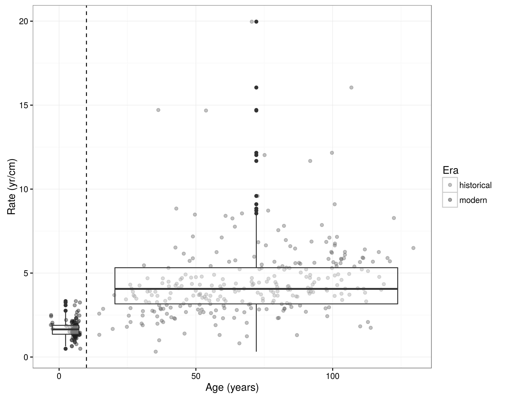

# Introduction

```{r load_libraries, echo=FALSE, message=FALSE, warnings = FALSE, results='hide'}

library(purrr, verbose = FALSE)
library(purrrlyr, verbose = FALSE)
library(ggplot2, verbose = FALSE)
library(neotoma, verbose = FALSE)
library(plyr, verbose = FALSE)
library(reshape2, verbose = FALSE)
library(mgcv, verbose = FALSE)
library(Bchron, verbose = FALSE)
library(viridis, verbose = FALSE)
library(dplyr, verbose = FALSE)
library(readr, verbose = FALSE)
library(gridExtra, verbose = FALSE)

version <- 0.1

```

Paleoecological research is increasingly dependent on large paleoecological databases to store and acquire data. These databases facilitate analysis over large spatio-temporal scales, but also on smaller local scales, and provide the opportunity to more easily undertake synthetic analysis and extend current understanding [@brewer2012paleoecoinformatics;@uhen2013card]. Most records stored in paleoecological databases contain data from paleo-ecological or -climate proxy samples and the chronology or ages of these samples, which is usually the result of the application of an age-depth model. It is often the case that paleoecologists wish to make inference about processes through time, and in this case the chronology assigned to a sedimentary archive can strongly affect the interpretation of a record. Paleoecologists have been aware of the varying methodologies and limitations in age modeling capabilities for some time, and the issues that these limitations cause are well noted [@grimm2009magnitude;@liu2012temporal].  

As a step towards methodological consistency, recent efforts have focused on standardizing age models for records within a database [@giesecke2014towards] and establishing regional benchmarks [@blois2011methodological;@flantua2016geochronological]. European models used the software Clam [@blaauw2010methods], as did efforts with the North American Pollen Database [@blois2011methodological]. Towards methodological soundness, the paleoecological community has begun to recognized the value in explicitly accounting for uncertainty in processes. Recent developments in age modelling include several ...Something about advances in age-depth methods since the line or spline? With the development of tools that account for uncertainty comes the need for databases to store these uncertainty estimates; while this is not yet possible... 

As ecologists increasingly rely on paleoecological records to infer past ecosytem change, and analyses increase in complexity and/or scale, the limitations of extant age models become more problematic.  Indeed, it is possible to wiggle match many different patterns, and the flexibility in modeling age-depth relationships can introduce additional "researcher degrees of freedom" that might lead to greater rates of false-positive relationships in paleoecological research [@blaauw2012out]. The reliability of extant age models may be questionable for at least two reasons: 1) the lack robust of uncertainty quantification, and 2) their construction was carried out in radiocarbon years.

<!-- What is this last sentence in above paragraph trying to say? Needs clarification -->

Reliable sediment age estimates require the accurate dating of high quality stratigraphic control points, well supported conversion from radiometric (often radiocarbon) to calendar years, robust and reliable models that reflect, as best as possible, the underlying process of sediment deposition and accumulation, and clear quantification of uncertainty that is able to take into account measurement and modelling uncertainty.

Chronology construction is dependant on the availability of dated stratigraphic control points from a sediment core. These control points may be geochronological (dated material), geostratigraphic (e.g., the “modern” core top), and sometimes biostratigraphic (changes in pollen assemblages associated with dated changes on the landscape). Geochronological control point ages are often uncertain due to analytical errors during the laboratory radiocarbon dating process [@ward1978procedures], the conversion of radiocarbon to calendar years [@reimer2013selection], and potential differences between the ages of macrofossil material and age of sediment [@blois2011methodological]. Geostratigrahic markers may have fewer sources of uncertainty -- the core top age is assumed to be the year of sampling -- although sedimentary mixing of the upper sediment during sampling does introduce some uncertainty. Finally, biostratigraphic control points are determined by the examination (usually visual) of changes in pollen assemblages throughout a core. However, time series of pollen counts are noisy, and in practice identifying changes in composition is both difficult and subjective [@dawson2016quantifying]. There remains uncertainty in the identification of compositional shifts related to the chronological/stratigraphic sampling density [@liu2012temporal], and, in the case of landscape-scale phenomena such as the mid-Holocene Hemlock decline [@bennett2002determining;@davis1981outbreaks], the need to assign temporal bounds to the landscape-scale phenomenon that caused the compositional shift.

The development of the first radiocarbon calibration curve (i.e. IntCal) was a major milestone in paleoecological analysis [@hughen1998intcal98]. The calibration curve (i.e. IntCal98, and subsequent iterations) allowed for the association of radiocarbon years with calendar years, based on material with known ages and associated ^14^C dates. The relationship between radiocarbon and calendar years is complex and non-linear, and given this complexity the calibration curve is an important tool that has contributed to improved chronology development. However, chronologies constructed prior to the development of the radiocarbon curve may have been performed in radiocarbon years.

Chronologies are, ultimately, approximations of the physical processes leading to variable sediment accumulation within depositional basins.  While methods such as Bacon [@blaauw2011flexible] may include autocorrelation terms intended to reflect physical processes, they do not explicitly attempt to model the physical process of sedimentation.  Recent theoretical work extends our understanding of sedimentation within lake basins [@bennett2016interpretation], providing broad relationships between basin shape and long term patterns of accumulation that could provide further support for chronologies with a mechanistic basis.  Varved lake records can act as controls to validate model precision and accuracy [@trachsel2017all].  Recent work compiling published varved records [@ojala2012characteristics] provides further insight into chronology accuracy, but varved records are spatially clustered and may be generated through a range of physical, biological and climatic conditions, indicating the possibility that these systems may not reflect broader controls on non-laminated (or varved) lacustrine systems.

Working with chronologies presents a challenge because there can be a significant difference in estimated sample age when stratigraphic control points are re-calibrated to calendar years and then used to generate an age-model (re-calibrated age models) versus when the age-model is developed in radiocarbon years and modelled sample ages are then re-calibrated to calendar years (direct recalibration). Comparing re-calibrated age models against directly calibrated dates highlights two issues. The first is the possibility of systematic offsets for large-scale research projects, the second is the need for direct intervention and systematic rules-based chronology construction in synthesis work.  Gieseke *et al*. [-@giesecke2014towards] undertook a broad-scale reconstruction of European records based on prior reported chronologies in an effort to facilitate broad-scale reconstruction of patterns and processes of vegetation change in Europe [@brewer2016late].  Blois *et al*. [-@blois2011methodological] undertook the same process for eastern North America.  Each of these were labor intensive and resulted in the construction of multiple new age models.  

```{r get_cores, echo=FALSE, message=FALSE, results='hide', warning=FALSE}

source('R/getNAcores.R')

all_downloads <- north_american_cores(version)

if (paste0('pubs_v', version, '.rds') %in% list.files('data/output')) {
  pubs <- readRDS(paste0('data/output/pubs_v', version, '.rds'))
} else {
  pubs <- neotoma::get_publication(all_downloads)
  saveRDS(pubs, file = paste0('data/output/pubs_v', version, '.rds'))
}

meta.table <- pubs %>% 
  map(function(x){
    metas <- do.call(rbind.data.frame, 
                     lapply(x, '[[', 'meta'))
    output <- metas[which.min(metas$year),]
    if(nrow(output) == 0) {
      output <- data.frame(id = NA, 
                           pub.type = NA, 
                           year = NA,
                           citation = NA)}
    return(output)}) %>% 
  bind_rows

chron <- sapply(all_downloads, function(x){
  types <- sapply(x$chronologies, function(x) x$age.type[1])
  age_types <- types[which.min(match(types, c("Calendar years BP",
                                              "Varve years BP",
                                              "Calibrated radiocarbon years BP",
                                              "Radiocarbon years BP")))]
  if(length(age_types) == 0) { age_types <- NA }
  return(age_types)})

meta.table$chron <- NA
meta.table$chron <- chron

```

Here we focus on the standardization and uncertainty quantification for the upper Midwestern United States using records from the Neotoma Paleoecology Database. The Neotoma database [@grimm2008neotoma] contains `r length(get_dataset(datasettype="pollen", ageold = 2000, ageyoung = -70))` global pollen records that can be used for paleoecological analysis.  These records have been obtained from publications that span a time period from  `r min(meta.table$year, na.rm=TRUE)` to `r max(meta.table$year, na.rm=TRUE)`, with more than half the records coming from before 1983.  For pollen records that are not "modern", sample age is obtained from a chronology constructed using classical [@blaauw2010methods] or Bayesian [@blaauw2011flexible; @buck2000bayesian;@blaauw2005radiocarbon;@ramsey1995radiocarbon] methods using dated material including radiocarbon (^14^C) and other radiometric dates (*e.g.* ^210^Pb, ^137^Cs).

While not the prefered method, direct recalibration of interpolated ages does occur within the Neotoma ecosystem.  For example, the temporal search function within the Neotoma Explorer (http://apps.neotomadb.org/explorer), Tilia (http://tiliait.org) and the Neotoma API (http://api.neotomadb.org) all use a lookup table that directly recalibrates ages in radiocarbon years.  However, this process results in systematic biases in both synthetic data (Figure 2) and in the actual Neotoma data (Figure 3).

However, across the Neotoma database (here we refer to North America only), many records within the database still record chronologies using only radiocarbon years (Figure 1). The transition from age models using only radiocarbon years to those with calibrated radiocarbon years within Neotoma is dramatic.  The final radiocarbon model appears to be from 1998, following this we see no more radiocarbon models.  Along with this transition, we are seeing a second transition from simple linear models to more complex models using flexible Bayesian methods.  A critical question then becomes, when faced with records generated using only uncalibrated dates, should we calibrate radiocarbon dates, generate age models *de novo*, or ignore the records altogether?

In the paper we take the position that develping new age models based on recalibrated stratigraphic control points that account for uncertainty is the ideal approach. However, large scale data analysis across heterogeneous data can be complex, thus the use of harmonized age models, that integrate ideas about the underlying mechanics of the processes linking depth and time become important [@blaauw2011flexible].  Developments since Blois *et al*. [-@blois2011methodological], and workshops such as the PAGES-sponsored Age Models, Chronologies, and Databases Workshop [@grimm2014working] have begun the process of outlining the methods required to undertake large-scale efforts to re-build age models. 

This paper builds on work from Dawson *et al*. [@dawson2016quantifying], which rebuilt existing age models using the Bacon framework, by explicitly detailling the steps neccessary to reconstruct a large number of models, and by quantifying the effects of decisions on aggregate outcomes, in the process of rebuilding models. In this paper we outline the decision making process around the parameter selection for the age models, we summarize differences between the original chronologies and the new chronologies, we higlight differences between chronologies generated using two age model types and highlight best practices for chronologies within large-scale synthesis.  We also identify limitations of current methods, that could serve to improve chronology construction in the future.


```{r, plot.chron.change, fig.width=6, echo=FALSE, message=FALSE, results='hide', warning=FALSE, dev='svg'}

source('R/figures/ageplot_histogram.R')

chronology_type_histogram(meta.table)

```

<object type="image/svg+xml" data="figures/histograms_cleaned.svg">
  Histograms of age model types against year of publication 
  <!-- fallback image in CSS -->
</object>

**Figure 1**.  *Number and type of default chronologies for North American pollen records in the Neotoma Paleoecological Database based on the original year of publication for the dataset.  Within Neotoma the default dataset chronology may be updated by subsequent researchers when this information is provided to a data steward.*

```{r, linear-fake, echo=FALSE, message=FALSE, results='hide', warning=FALSE, dev='svg'}

source('R/figures/compare_recalibrations.R')

if (paste0('comp_recal_v', version, '.rds') %in% list.files('data/output')) {
  comp_recal <- readRDS(paste0('data/output/comp_recal_v', version, '.rds'))
} else {
  comp_recal <- compare_recalibrations()
  saveRDS(comp_recal, file = paste0('data/output/comp_recal_v', version, '.rds'))
}

source('R/recalibrate.actual.R', echo = FALSE)

age_seq <- seq(1000, 21000, by = 1000)

new.chrons <- new.chrons %>%  
  filter(!core %in% c("Chalko Lake", "Aghnaghak", "Pittsburg Basin", 
                      "Lac à l'Ange", "Marl Pond", "Cheyenne Bottoms", 
                      "San Agustin Plains")) %>% 
  group_by(handle) %>% 
  mutate(max = findInterval(max(age.lin, na.rm = TRUE), age_seq)) %>% 
  na.omit

basic <- ggplot(new.chrons, aes(x = age.direct, y = age.lin)) + 
            geom_path(aes(group = handle, color = factor(max))) +
            scale_x_continuous(limits = c(-50, 21000), expand = c(0, 0)) +
            scale_y_continuous(limits = c(-50, 22000), expand = c(0, 0)) +
        theme_bw() +
        xlab('Direct Age Recalibration') +
        ylab('Linear Model Recalibration') +
        theme(axis.title.x = element_text(family = 'serif', 
                                    face = 'bold.italic', 
                                    size = 18),
              legend.position = 'none',
        axis.title.y = element_text(family = 'serif', 
                                    face = 'bold.italic', 
                                    size = 18),
        axis.ticks = element_blank(),
        axis.text.x = element_text(family = 'serif', 
                                    face = 'italic', 
                                    size = 14),
        axis.text.y = element_text(family = 'serif', 
                                    face = 'italic', 
                                    size = 14))

# This code block outputs the age models for each record and outputs 
# for (i in unique(new.chrons$handle)) {
#   if (!paste0(gsub('/', '_', i), '.png') %in% list.files('figures/recal_test/')) {
#     cat(i, '\n')
#     try(ggsave(filename = paste0('figures/recal_test/', gsub('/', '_', i), '.png'),
#            plot = ggplot(subset(new.chrons, handle %in% i), 
#                          aes(x = age.direct, y = age.lin)) + 
#               geom_abline(intercept = 0, slope = 1, color = 'red', alpha = 0.5) +
#               geom_line(size = 1.5) +
#               theme(legend.position = 'none') +
#               ggtitle(i) +
#              theme_bw() +
#              coord_equal() +
#               scale_x_continuous(limits = c(-50, 21000), expand = c(0, 0)) +
#               scale_y_continuous(limits = c(-50, 22000), expand = c(0, 0))))
#     try(dev.off())
#   }
# }

# Build an age model with a knot every 500 years:
diff.model <- gam(diff ~ s(age.lin, k = 42), 
                  data = new.chrons)

diff.pred <- predict(diff.model,
                     newdata = data.frame(age.lin = seq(0, 21000, by = 10)),
                     se.fit = TRUE, type = 'response')

diff.data <- data.frame(age = seq(0, 21000, by = 10),
                        pred = diff.pred[[1]], 
                        se   = diff.pred[[2]])

diff <- ggplot() +
            geom_point(data = new.chrons, 
                       aes(x = age.lin, y = diff, color = as.factor(max))) +
            geom_ribbon(data = diff.data, 
                        aes(x = age, ymax = pred + se * 1.96, 
                            ymin = pred - se * 1.96), 
                        color = 'red', alpha = 0.5) +
            scale_x_continuous(limits = c(0, 21000), expand = c(0, 0)) +
            scale_y_continuous(limits = c(-2000, 2000), expand = c(0, 0)) +
            geom_hline(aes(yintercept = 0)) +
            xlab('Linear Model with Recalibration') +
            ylab('Model Difference') +
          theme_bw() +
          theme(axis.title.x = element_text(family = 'serif', 
                                      face = 'bold.italic', 
                                      size = 18),
                legend.position = 'none',
          axis.title.y = element_text(family = 'serif', 
                                      face = 'bold.italic', 
                                      size = 18),
          axis.ticks = element_blank(),
          axis.text.x = element_text(family = 'serif', 
                                      face = 'italic',
                                      size = 14),
          axis.text.y = element_text(family = 'serif', 
                                      face = 'italic', 
                                      size = 14))

ggsave(file = 'figures/difference.svg', plot = diff, width = 9, height = 2.5)

```

<object type="image/svg+xml" data="figures/agediff_plot_final.svg" style="width: 100%;height: 100%;">
  Differences between age models and direct recalibration.
  <!-- fallback image in CSS -->
</object>


**Figure 2**. *The difference between (a) directly calibrating (red arrows) radiocarbon ages from an existing model (black dashed line) and (b) rebuilding age models using linear interpolatation (red dashed line) from calibrated radiocarbon ages (red line).  Negative values indicate that recalibration of interpolated ^14^C dates followed by linear interpolation of calibrated ages provides systematically older ages than direct recalibration of interpolated ages. (d) Using the chronological controls of the default age model from Neotoma records, calibrate chronological controls reported in radiocarbon years, and then use linear interpolation.  Any records with age-reversals were rejected to simplify this illustrative example.*

# Methods

Estimating age-depth relationships requires that several decisions be made about suitable chronological controls, as well as model class and inputs. The objective of this work was to estimate the ages of pollen samples with uncertainty. There are several suitable tools and models that can be used to obtain these estimates, including Bacon, Bchron, and Oxcal (are there others?). Here we work with Bacon because it 1) implements a Bayesian framework that estimates sample age posteriors, 2) is widely used in the paloecological community, and 3) accounts for some of the key components in the sediment deposition and accumulation process. Using Bacon to estimate age-depth relationships requires the specification of: 1) chronological controls, which include radiometric dates, biostratigraphic markers, and their uncertainty, 2) priors on the accumulation rate and memory, 3) input values for variable that define the resolution and structure of the divisions of the sediment core. To ensure a consistent methodology among sediment core in the UMW domain, we developed a set of standard decisions that are described below.

## Chronological Uncertainty

### Dealing with zero-value ^210^Pb errors

Bacon requires that all chronological markers be associated with defined errors. Historically, some ^210^Pb data entered into Neotoma was entered without error reporting.  Of the 398 ^210^Pb markers in Neotoma, 148 have no error reported.  Binford [-@binford1990calculation] reports *"Ninety-five per cent confidence intervals range from about 1 -- 2 years at 10 years of age, 10 -- 20 at 100 years, and 80 -- 90 at 150 years old."*  Using this assessment we fit a smooth linear function to assign 95% confidence intervals for all ^210^Pb dates with missing uncertainty data.  These confidence intervals were then divided by 2 (and the integer ceiling taken) to obtain standard deviations to be used in the Bacon model.

```{r, echo=FALSE, message=FALSE, results='hide', warning=FALSE, dev='svg'}

all_geochron <- readRDS(paste0('data/output/all_geochron_v', version, '.rds'))

source('R/lead_plotting.R')

lead_plots(all_geochron)

```

**Figure 4.** *Reported uncertainty for ^210^Pb dates within Neotoma, by age, with the total count of unassigned samples by age bin (lower).  Estimated uncertainty, using a model relating reported ^210^Pb uncertainty to age, is then assigned to all ^210^Pb dates with unreported uncertainty.* 

### Expert elicitation exercise to identify settlement horizon

Age estimates of pollen samples, and in some cases their uncertainty, can be estimated using an age-depth model determined by a combination of the chronological controls. To determine which sample best represents pre-settlement times, it is possible to select the sample closest in age but not younger than the time of settlement. Instead, we rely on the existence of a biostratigraphic signal corresponding with the time of interest. During European settlement, land-clearances led to noticeable increases in certain agricultural indicators that is reflected in the pollen records, especially *Ambrosia* [@mcandrews1988human]. This change in the relative abundance of Ambrosia, referred to as the *Ambrosia* rise, can be used to identify a reasonably representative presettlement assemblage that justifiable precedes major land clearance - here the pre-settlement pollen sample is defined to be the sample immediately prior to the first pollen sample that reflects the *Ambrosia* rise. We deal with some of the uncertainty associated with the identification of a biostratigraphic marker by: 1) avoiding the need to assign a date to our representative pre-settlement assemblage, and 2) using expert elicitation to reduce expert bias.

The *Ambrosia* rise is a well known phenomenon in the eastern United States, and elsewhere, that appears to be contemporraneous with Euro-American settlement, land clearance and the initiation of intensive agriculture in the region [@McAndrews1968;@mcandrews1988human]. In the Upper Midwest, significant increases in *Ambrosia*, *Rumex*, and/or Poaceae are typically coincident with the settlement horizon. Because of this feature it is possible to establish a biostratigraphic chronological control. When the rise can be identified visually it can be used as a stratigraphic marker with an age defined as either immediately preceeding (when the "pre-settlement" sample is used), or immedately after.  The pre-settlement sample has been identified for many of the fossil pollen cores in the Neotoma database, to reduce variability associated with the protocol used to determine these samples we asked a team of experts to identify pre-settlement samples based only on pollen diagrams depicting proportional changes through time as a function of depth for key indicator species and the ten most abundant arboreal taxa. Experts were prohibited from relying on stratigraphic dates (radiocarbon or other) or age-depth model estimates of sample age.

For a summary of the settlement horizon elicitation exercise, see the calibration paper [@dawson2016quantifying].

To generate the prediction data set, we would like to make use of the elicitation exercise results in order to include an additional stratigraphic marker in the chronological control tables. To do this, we need to be able to assign pre-settlement ages that correspond with the expert-determined pre-settlement depths with some confidence. From the PLS data, we have corresponding sample year for all sampled location. Within each grid cell, we determined the maximum sampling year, and then our pre-settlement age was determined by subtracting 50 from this value. The period of settlement across the upper Midwestern United States spanned from 1820 - 1910 [@goring2016novel], providing a potential period of settlement spanning nearly 100 years, thus we applied an age uncertainty (stanadrd deviation) of 50 years for the settlement marker, around the date of survey for the grid cell within which the core was located.  Ideally, methods would provide the opportunity to include asymmetric uncertainty, since, in the case of the settlement horizon, we know the minimum age, but not the most recent age of potential settlement.

Five cores were located within grid cells without digitized PLS data. In these cases, we look to the surrounding grid cells to estimate the maximum sampling year. In the upper peninsula of Michigan, there was a single site for which there was no PLS data, which was assigned a maximum sampling year of 1860. The four remaining grid cells in which there were cores but no PLS data were in the lower peninsula of Michigan, and were assigned a maximum year of sampling of 1840.

## Bacon Settings

### Accumulation Rate Priors

Bacon provides a default accumulation rate based on Goring *et al*. [-@goring2012deposition]'s survey of Holocene accumulation rates in eastern North America.  Empirical age-depth curves suggest that the age-depth relationship is non-linear, as a result of sediment compaction in the upper sediments [@goring2012deposition], basin shape [@bennett2016interpretation] and patterns of deposition and sediment transport operating on longer time scales [@goring2012deposition;@webb1988rates]. Narrowing the geographic and temporal range for the target reconstructions made it neccessary to re-asses mean accumulation rates using an approach similar to Goring *et al*. [-@goring2012deposition], focused on a narrower temporal and spatial window.  Goring *et al*. [-@goring2012deposition] show that there is a rapid inflection point in accumulation rates at approximately 500ybp.  Regionally, there is evidence that after the time of settlement, sediment accumulation is much faster (fewer years per cm of sediment accumulation) than before settlement (more years per cm of sdeiment accumulation), although bulk density may decrease (Figure 4).

Although it is compelling to speculate that the coincidence of a change in rates with Euro-American Settlement and associated changes in land use and erosion, many sites show a similar inflection, even in regions that remain largely protected from widespread land use change [@goring2012deposition]. To account for non-linearity in accumulation rates, we assign the modern prior for the post-settlement portion of the core, and a 2K prior for the pre-settlement portion of the core. In practice, it is difficult to determine settlement horizon depth, but results from an expert elicitation exercise [@dawson2016quantifying; @kujawa2016theeffect] provides us with an estimate of the settlement depth for most cores.  Cores for which experts were unable to assign a horizon were given a 2K prior only, while an "instantaneous" hiatus was placed at the pre-settlement sample depth, which then faciliated a non-linear accumulation rate witin the chronology.  No hiatus was assigned and the modern accumulation rate prior was used for cores with only core top and pre-settlement markers.

For the upper Midwest we computed empirical accumulation rates for consecutive pairs of geochronological markers, within sites obtained from the Neotoma database. We used the mean age for adjacent markers as the assigned age for each accumulation rate. Rates were split into two groups based on their ages: modern, which encompassed the present to 100 cal yr BP (the Modern prior), and from 100 cal yr BP to 2000 cal yr BP (the 2K prior). Summary statistics were computed for each group of accumulation rates. Gamma ($/gamma$) priors were defined for both time periods, each with a mean equal to the empirical mean of accumulation rates for that time period, and a variance equal to double the empirical variance from the grouped accumulation rates.  Doubling the empirical variance represents a conservative approach to modeling uncertainty, in that it accounts for additional variability in accumulation rates that was not observed in the data.

### Determining section thickness

Bacon works by diving a core into sections whose width are determined by the user [@blaauw2011flexible]. Sections are the atomic unit of a Bacon model, and various parameters are fit within each section.  In particular, the `memory` parameter defines the flexibility of the accumulation rates within a single chronology, thus a model with large section thicknesses will be, by virtue of having fewer overall sections, less flexible. However, narrow section thicknesses result in very large run-times, and may show other, unanticipated problems associated with finding fit in multi-parameter space.

Dividing a core into sections is an approximation of time discretization, abstracted through the process of deposition.  While consistent section widths across all cores (and thus consistent discretization) should be a goal, in practice, the internal unmeasurable variability in sedimentation rates, and uncertainty in the models themselves, makes the implementation of consistent section thicknesses difficult.  To provide prescriptive widths, but still allow flexibility as needed in the Bacon modelling, each core was run with widths of 5, 10, 15 and 20cm.  Model fit was assessed visually, and the best fit model was subsequently chosen to be the default calibrated age model for that core.

# Results

## Age Controls

### ^210^Pb Errors

```{r, lead_comparison, results = 'hide', echo = FALSE, warning=FALSE, dev='svg'}

source('R/lead_ages.R')
comp_doc <- compare_lead()

comp_doc[[1]]
```

**Figure 5**. *Reported and estimated ^210^Pb ages from the Bacon models show strong accordance, for the most part.  Uncertainties within the constructed Bacon models at the depths of the ^210^Pb samples show higher uncertainty, which likely reflects the influence of the model itself since the autoregressive nature of the model, the influence of the memory parameter, and the nature of the Bayesian model itself.*

```{r, error_by_age, results = 'hide', echo = FALSE, warning=FALSE}

lead_out <- comp_doc[[2]]

drop_outlier <- lead_out %>% 
  filter(bacon_error1 < 200) %>% 
  select(site.name, age, bacon_error1, e.older) %>% 
  na.omit() %>% 
  arrange(site.name, age)

lead_comp_plot <- ggplot(data = drop_outlier) + 
  geom_point(aes(x = age, y = bacon_error1, shape = site.name), 
             alpha = 0.7, size = 3) +
  geom_point(aes(x = age, y = e.older, shape = site.name), 
             color = 'red', alpha = 0.7, size = 3) +
  geom_ribbon(aes(x = age, ymin = e.older, ymax= bacon_error1, group = site.name),
              alpha = 0.1, color = alpha(colour = 'black', 0.2)) +
  geom_segment(aes(x = age, xend = age, 
                   y = bacon_error1, yend = e.older), alpha = 0.3) +
  scale_x_continuous(limits=c(-50, 100)) +
  scale_y_continuous(limits=c(0, 80)) +
  coord_equal(expand = c(0,0)) +
  xlab('Years Before Present') +
  ylab('Model Uncertainty') +
  annotate("text", x = -25, y = 80, label = "Bacon Uncertainty") +
  annotate("text", x = -25, y = 75, label = "210Pb Uncertainty", color = "red") +
  theme_bw() +
    theme(axis.title.x = element_text(family = 'serif', 
                                      face = 'bold.italic', 
                                      size = 18),
          axis.title.y = element_text(family = 'serif', 
                                      face = 'bold.italic', 
                                      size = 18),
          axis.ticks = element_blank(),
          axis.text.x = element_text(family = 'serif', 
                                     face = 'italic', 
                                     size = 14),
          axis.text.y = element_text(family = 'serif', 
                                     face = 'italic', 
                                     size = 14))

ggsave(filename = 'figures/lead_comp_plot.svg', plot = lead_comp_plot, width = 8, height = 5)

```

<object type="image/svg+xml" data="figures/lead_comp_final.svg">
  Comparison of 210Pb dates measured and reconstructed error at those depths. 
  <!-- fallback image in CSS -->
</object>

**Figure 6**. *For the three cores within the region with both reported ^210^Pb and reconstructed Bacon uncertainties we see consistently higher uncertaintites for the Bacon uncertainties, although the magnitude of the difference varies by record.  Fish Lake shows the smallest difference, while reconstructed ages for Brown's Bay shows the largest difference.  Crooked Lake shows strong variability in the magnitude of the difference, even among adjacent age samples.*

Bacon uncertainty estimates within the chronologies are consistently larger than the ^210^Pb error estimates for the point samples.  For some records the uncertainty is much higher, while for others the difference in uncertainty is lower.  It is worth noting that only three records have completely paired ^210^Pb records.  I'm not sure why.

### Expert Elicitation

```{r, elecitation_plot, echo = FALSE, message = FALSE, warning = FALSE, error = FALSE}
source('R/elicitation_plot.R')

elicitation_plots <- expert_elicitation()

```

On average, the original modeled ages were older than the biostratigraphic ages assigned based on the dates for Public Land Surveys in the vicinity of the focal lakes.  Bacon models showed better affinity to the assigned biostratigraphic dates based on expert identification of the *Ambrosia* rise in the region.  This age differential means that Bacon models are, on average, 44 years younger at the settlement horizon.

```{r, echo = FALSE, message = FALSE, warning = FALSE, error = FALSE, dev = 'svg'}
elicitation_plots[[1]]
```

## Bacon Settings

### Accumulation Rate Priors

Accumulation rates for records in the region show clear differentiation between accumulation rates within the last 200 years and accumulations prior.  Means and variance are presented in **Table 1** along with Gamma parameters.  Accumulation rates (the mean years per cm deposition) change dramatically, dropping by five-fold in the modern period.



**Figure 7**. *Sediment accumulation rates for cores in the study region with samples in the last 200 years (in calibrated radiocarbon years, with 0 at 1950 CE).  A clear break can be seen across the records.*

*Table 1*. The estimates from the accumulation rates.

 Group   Mean	   Variance	    Rate	   Shape
------ -------- ----------- -------- -------
Modern	3.02	     5.70	      0.53     1.6
2K	    15.00	     250	      0.06	   0.9


### Section Thickness

```{r, get_thickness, echo = FALSE, message = FALSE, warning = FALSE, error = FALSE}

source('R/thick_model.R')
model_plot <- allan_thick()

```

Bacon models were fit with section thicknesses for values of 5, 10, 15 and 20cm for each core.  For each section thickness the section thickness with the best fit model was chosen.  A generalized linear model using a gamma family shows a significant relationship between total core length and best-fit section thickness ($F_{1.241}$ = `r model_plot$glm$F`, p > 0.001).  This relationship indicates the general principle of wider section thicknesses for Bacon models on longer cores holds generally, but, the distribution of best-fit thicknesses (Figure 8) also appears to indicate that many shorter cores are well served by wide section thicknesses.  The model itself accounts for only 26% of total deviance, and should be treated as indicative, but not prescriptive.

```{r, plot_thicknessmodel, echo = FALSE, message = FALSE, warning = FALSE, error = FALSE, dev = 'svg'}

model_plot[[1]]

```

**Figure 8**. *Bacon section thickness as a function of total core length for best-fit Bacon models on each of the 282 sediment cores with reconstructed age models from the upper Midwestern United States used in this study.  A curve (blue line) fit with a generalized linear model with gamma family indicates the predicted relationship between maximum core depth and the best-fit core thickness (gray shading represents 1 standard error).*

# Discussion

Large scale synthesis of paleoecological records relies on our ability to distinguish synchronous, time transient and asynchronous events at a range of spatial scales.  For this reason chronology has become central to understanding earth system processes [@harrison2016geochronology].  Standardized age models, across data sets within a synthesis project reduces a significant source of variability, and, using Bayesian approaches, can improve the ability of researcher to take temporal uncertainty into account when assessing the influence of climatic and biotic factors in driving vegetation change on the landscape.  Our approach in this paper, and the associated analysis in Dawson et al. [@dawson2016quantifying] and elsewhere has shown what is possible for large-scale sysntehsis projects, and also, we hope, can serve as a roadmap for future endevours.

A challenge for paleoecologists is that site level effects can often play a significant role in sediment accumulation, pollen accumulation and the interpretation of model results.  When working with aggregate data it is possible to lose sight of these site level effects, and the potential benefits of doing batch runs with the latest software might make a researcher overlook the peculiarities associated with individual records.  Knowing the data well and taking time to examine results in the context of the original publications is critical to evaluating the quality of a record.  In this exercise a number of records were rejected, a number of records had modifications made and some peculiar records were retained based on documetation within the primary litaerature.  There is no alternative to knowing your data well.

## Current Challenges & Next Steps

| Challenge | Solution |
| ------------------- | -------------------------------------- |
| Age uncertainties vary in the shape of their distributions. |  Allow uncertainty models to include other distributions, including truncated distributions. |
| Age models require significant oversight |  Codify certain decisions, provide testing suites for fit parameters. |
| Accumulation rates change through time but priors are fixed. | The current solution is to use 'zero-length' hiatuses, which serve to reset the accumulation rate, but allowing models of change based on empirical studies would improve fit. |
| Parameter values can have significant, but unintuitive effects on model fit   | Allowing models to accept vectors of possible values may improve fit and provide a better understanding of the interacting relationships between model parameters.   |
| Ensuring that model outputs are clear and the decisions made about parameters are justified.  | Improved uptake of reproducible workflows and use of provenance tools. |

Point to BChron as another option, Bacon STAN model, UColo Age Model Thing (CSciBox - https://www.cs.colorado.edu/~lizb/cscience.html) and geochronR.

# Conclusions

We know lots now that we didn't know before.  If you read carefully you would too.

# Acknowledgements

This work is a contribution of the PalEON Project (http://paleon-project.org).  SJG would like to thank support from NSG, CEG and AMG.

# References
