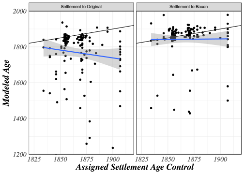
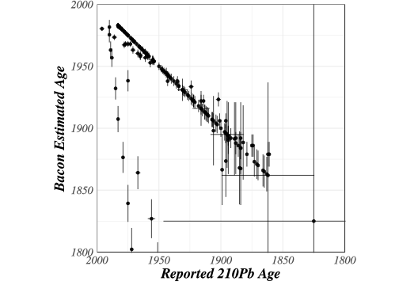
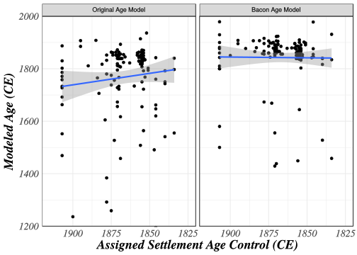
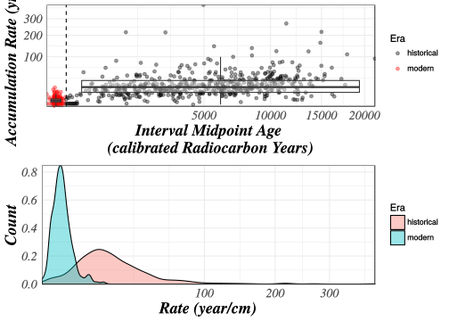
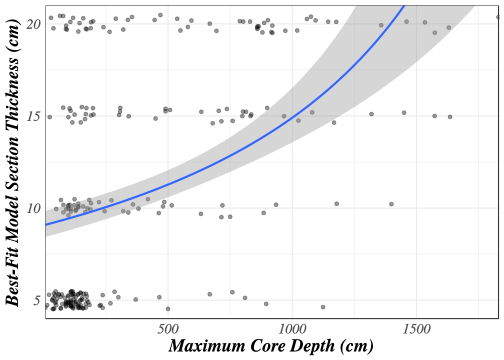

# Age Models in Large Scale Paleoecological Synthesis

# Introduction

Advances in paleoecoinformatics are continually improving our ability to store and process large numbers of paleoecological records [@brewer2012paleoecoinformatics;@uhen2013card;@williams2017neotoma], which enables the use of increasingly large data networks to study ecological and climatic processes operating at large spatial scales and at timescales inaccessible to modern observational data [@marlon2017climatic;@bothe2015continental;@abram2016early]. Paleoecological and paleoclimatic databases streamline this process by providing the means to store, curate, and query structured data across specified spatial and temporal bounds. Examples of these databases include NOAA-Paleoclimatology (https://www.ncdc.noaa.gov/data-access/paleoclimatology-data)[], Linked Earth (http://linked.earth/)[], and the Neotoma Paleoecology Database [@williams2017neotoma; URL: http://neotomadb.org]. Generating accurate and precise age inferences using the best available age controls and state-of-the-art age-depth models is a key challenge for scientists using paleoecological data resources for large-scale data syntheses.  Because of the increasingly large data volumes involved (for example, as of 2018-03-02, Neotoma now includes 8) site-level records, including 3553 fossil pollen records globally), the central challenge in large-scale regeneration of chronologies is how best to balance speed/automation with careful critical analysis and adjustment of individual age models by experts.  Here we review these issues, assess key sources of uncertainty, and provide examples of solutions developed during our recent data synthesis efforts with the Neotoma Paleoecology Database and the Paleoecological Observatory Network (PalEON).

An emerging practice in paleoecological and paleoclimatic data resources is to store both the original proxy measurements by depth (*e.g.*, the stratigraphic position of vertebrate specimens or micropaleontological assemblages) and the associated age controls, so that age estimates for the proxy measurements can be regenerated as age-depth models and geochronological parameterizations improve [@grimm2014working;@blois2011methodological;@giesecke2014towards].  The chronology for a given record comprises three distinct elements: the age-depth model used for a given paleoecological or paleoclimatic record, the age controls that constrain that age model, and the resultant age estimates for all stratigraphic depths or intervals in that record [@mckay2015linked;@grimm2008neotoma]. Robust chronologies require accurate and precise estimates of absolute ages from radiometric and other age controls, well supported conversion from radiocarbon years to calendar years, age-depth models that make use of prior knowledge [*e.g.* Steno's Law of stratigraphic superposition and rates of sediment deposition and accumulation, @goring2012deposition], and a clear quantification of uncertainty that accounts for both measurement and process uncertainty.  

The accuracy and precision of these chronologies are fundamental to paleoecological interpretation, and indeed, geochronology and age models are central to our understanding of the evolution of the earth system [@harrison2016geochronology]. Quaternary scientists are, of course, well aware of the fundamental importance of chronologies, and various papers have explored these issues and the interpretive challenges that can arise from them [@grimm2009magnitude;@liu2012temporal;@trachsel2017all;@blaauw2012out].

Data resources such as Neotoma or LinkedEarth/LiPD can store multiple chronologies for a given record.  Because updating age-depth models takes time and expertise, the stored chronologies do not always conform to the current state of the art in chronology construction.  These legacy age models may have various issues, e.g. 1) no conversion from radiocarbon years to calendar years, 2) conversions that are based on outdated radiocarbon calibration curves, 3) a lack of robust uncertainty quantification, 4) inconsistencies among sites in reconstruction methods, resulting in potential biases. One shortcut workaround used in Neotoma for its legacy chronologies expressed in radiocarbon years is a *post hoc* conversion of individual age estimates to calendar years.  This practice is sufficient for first-pass queries to discover and retrieve data by temporal bounds, however this is insufficient for research-quality data syntheses since it produces systematic offsets on the order of hundreds of years (Fig. 1).

<object type="image/svg+xml" data="figures/agediff_plot_final.svg" style="width: 100%;">
Differences between age models and direct recalibration.
  <!-- fallback image in CSS -->
</object>

**Figure 1**. *Diagram of two methods for generating calibrated dates from radiocarbon age-models.  (a) Each age (in radiocarbon years) is calibrated directly (red arrows) from an existing model (black dashed line) or (b) the age models is reconstructed using linear interpolatation (red dashed line) from calibrated radiocarbon ages (red line).  Negative values indicate that recalibration of interpolated ^14^C dates followed by linear interpolation of calibrated ages provides systematically older ages than direct recalibration of interpolated ages. (d) Using the chronological controls of the default age model from Neotoma records, calibrate chronological controls reported in radiocarbon years, and then use linear interpolation.  Any records with age-reversals were rejected to simplify this illustrative example.*

Hence, an early step in any large-scale data synthesis is to review the extant chronologies associated with the records at hand and update them as needed. Ideally, these updated chronologies should be placed back into the archival data resources, to maximize comparability of results across studies, reproducibility, and reuse by other researchers. Recent examples of large-scale paleo-synthesis analysis have focused on standardizing age models for records within a database  and establishing regional benchmarks . Age model standardization in Europe relied on the Clam software , as did efforts with the North American Pollen Database [@blois2011methodological]. 

At the same time, Bayesian approaches are becoming the new standard in age-depth modeling, because of their ability to return robust uncertainty estimates, and to incorporate knowledge about system processes and prior knowlege into the sedimentation models [*e.g.*, @blaauw2011flexible;@ramsey2013recent;@parnell2016package]. Although many site-level papers have adopted Bayesian methods, few large scale syntheses have done so [e.g., the ACER database used Clam: @sanchez2017acer].

A number of issues arise during the large scale generation of many chronologies. First, building an age-depth model requires expert judgement: there are enough complexities in sedment stratigraphies and geochronological data that fully automated plug-and-play solutions do not yet have a high probability of returning accurate age inference.  However, the subjectivity and flexibility inherent to age-depth modeling may introduce additional "researcher degrees of freedom" that could lead to greater rates of false-positive relationships in paleoecological research [-@blaauw2012out]. Bacon, for example, contains various parameters, priors, and settings such (e.g., sediment accumulation rates) that may be unknown, or complex to implement at large spatial or temporal scales [@sanchez2017acer].

Reliable sediment age estimates require accurate dating of high quality stratigraphic control points, well supported conversion from radiometric (often radiocarbon) to calendar years, robust and reliable models that mehcanistically or empirically represent the underlying process of sediment deposition and accumulation, and clear quantification of uncertainty that is able to take into account measurement and process uncertainty.

Second, many different kinds of age controls may be used to constrain age-depth models, each with its own methodological underpinning and associated sources of uncertainty: accurate quantification of age estimates and uncertainty must incorporate all these sources.  These include radiometric dates or other absolute age estimates (*e.g.*, ^14^C, ^210^Pb), stratigraphic horizons (*e.g.*, modern core tops), or biostratigraphic events (*e.g.*, changes in pollen assemblages associated with dated changes on the landscape).  Sources of uncertainty in radiometric dating include analytical errors in laboratory radiocarbon dating processes [@ward1978procedures], the calibration of certain age types [*e.g.*, radiocarbon to calendar year calibration; @reimer2013selection], choices among calibration models, and potential differences between the ages of dated material and the age of deposition of the sediment matrix [@blois2011methodological].

 The magnitude and sources of uncertainty in stratigraphic markers varies.  For sites with continuous deposition, the core top age can be assumed to be the year (or decade) of sampling, while tephras are often widespread and well dated.  However, not all tephras are well dated and not all tephra deposits at a given site can be confidently matched to known eruption events or previously dated tephra deposits [@watson2016peatlands;@mackay2016mid]. Biostratigraphic age controls are determined by the identification of changes in biological proxies  that correspond to well-dated events, e.g. EuroAmerican land clearance [@mcandrews1988human]. Although identification of these events usually requires on visual identification by experts, the uncertainty in these estimates can be quantified through expert elicitation [@dawson2016quantifying;@kujawa2016theeffect] and assigned to changes in biological proxies that correspond to well dated events such as EuroAmerican land clearance in eastern North America [@McAndrews1968]. Further uncertainties arise from variations in sample density [@liu2012temporal], and questions over whether biological events were synchronous across sites, time-transgressive, or a temporal mosaic [@bennett2002determining;@davis1981outbreaks;@williams2011extrinsic;blois2011methodological]. Large networks of sites with well-constrained chronologies can provide answers to these questions and constrain the temporal uncertainty associated with using biostratigraphic control points in age models [@blois2011methodological].

<object type="image/svg+xml" data="figures/histograms_cleaned.svg">
  Histograms of age model types against year of publication 
  <!-- fallback image in CSS -->
</object>

**Figure 2**.  *Number and type of default chronologies for North American pollen records in the Neotoma Paleoecological Database based on the original year of publication for the dataset.  Within Neotoma the default dataset chronology may be updated by subsequent researchers when this information is provided to a data steward.*

Here we describe and review the methods used to generate a large number of chronologies and quantify the effects of decisions made on aggregate outcomes.  This effort serves the dual goals of documenting the decisions made, and also reviewing and illustrating the challenges inherent to this effort, as a guide for other researchers interested in pursuing similar efforts.  All samples were drawn from the Neotoma Paleoecological Database: all chronologies were built using the age-depth model.  These chronologies were built to support efforts to reconstruct centennial- to millennial-scale compositional changes in forest dynamics in the upper Midwestern United States with uncertainty using the STEPPS pollen-vegetation model [@dawson2016quantifying].  We outline the decision making process around age-model parameter selection, summarize differences between the original chronologies and the new chronologies, and highlight best practices for chronologies within large-scale synthesis.  We also identify limitations of current methods, that could serve to improve chronology construction in the future.

# Key Issues in Generating Age Models from Neotoma

## Use of *posthoc* calibration of individual ages in radiocarbon chronologies

Many legacy pollen records in Neotoma still record chronologies using only radiocarbon years (Figure 2). The transition from age models using only radiocarbon years to those with calibrated radiocarbon years within Neotoma is dramatic.  The final radiocarbon model added to Neotoma was created in 1998.  Along with this transition, a second transition from simple linear models to more complex models using flexible Bayesian methods exists, although this is not shown.

While not the preferred method, direct recalibration of interpolated ages does occur within the Neotoma software ecosystem as a *post hoc* calibration of the derived age estimates for individual samples. For example, the temporal search function within the Neotoma Explorer (http://apps.neotomadb.org/explorer), Tilia (http://tiliait.org) and the Neotoma API (http://api.neotomadb.org) all use a lookup table that directly matches calendar years before 1950 to radiocarbon years if no calibrated chronology exists for a record. However, this process results in systematic biases in both synthetic data and in the actual Neotoma data, on the order of approximately 125 years across the last 20000 cal yr BP, but upwards of 500 years during some millenia (Figure 1).  Hence, this *post hoc* approach is suitable for most data discovery and outreach applications, but is clearly unacceptable for most research-level data syntheses.

## Choice of Age-Model Type and Software

Estimating age-depth relationships and uncertainties requires that decisions be made about the type of age modeling approach, choice of software implementation, suitable chronological controls and model parameters [@blois2011methodological;@grimm2014working;@giesecke2014towards]. We here pursue Bayesian approaches for their ability to flexibily estimate the ages of pollen samples with robust uncertainty. Several Bayesian age modelling software packages exist, including Bacon, Bcal, Bchron, and Oxcal. We use Bacon because it 1) implements a Bayesian framework that estimates sample age posteriors, 2) is widely used by paloecologists [e.g., @charman2015drivers;@wang2017southern], and 3) accounts for some of the key components in the sediment deposition and accumulation process. Using Bacon to estimate age-depth relationships requires the specification of: 1) chronological controls, which include radiometric dates, biostratigraphic markers, and their uncertainty, 2) priors on the accumulation rate and memory, 3) values for the resolution and structure of divisions within the sediment core (section thicknesses and hiatuses). To ensure a consistent methods and age inferences among sediment cores in the UMW domain, we developed a set of standard decisions for each of these three components, and analyze the effects of these decisions on age estimates and uncertainty.

## Choice of Age Controls and Types

Neotoma contains 90 age control types, including various pollen stratigraphic controls, radiocarbon and other isotopic dates and marine isotope stages.  Since associated analysis in Dawson *et al*. [-@dawson2016quantifying] was focused on reconstructing vegetation compositional dynamics in the late-Holocene, most chronological controls presented here are appropriate for teporal domains from the present back to 10^1^ to 10^5^ years before 1950, including ^210^Pb, ^137^Cs, and ^14^C dates, as well as biostratigraphic dates associated with events of known or inferred dates, such as historical fires and the *Tsuga* decline.  Core tops are often used, and have highly certain dates, however, several older records use interpolated dates for the core top when sediment was lost in the coring process.  These cores should be treated with caution, and this is often noted in the core description.

## Chronological Uncertainty

Methods for assessing and managing radiocarbon uncertainty in large-scale data syntheses are well established [@blois2011methodological], however the use of ^210^Pb and biostratigraphic dates has been less well established. One challenge with ^210^Pb dates is that, because uncertainty of ^210^Pb dates are small (sometimes less than 1yr), the uncertainties are often unreported, or not stored in paleoecological databases such as Neotoma.  Another issue is that the analytical uncertainty associated with a ^210^Pb date is an underestimate of the derived age inference.

### Dealing with zero-value ^210^Pb errors

Bacon requires that all age controls be associated with defined errors. Historically, some ^210^Pb data entered into Neotoma were entered without error reporting.  Of the 398 ^210^Pb age controls in Neotoma (as of 2018-03-02), 148 have no error reported (Figure 3).  Binford [-@binford1990calculation] reports *"Ninety-five per cent confidence intervals range from about 1 -- 2 years at 10 years of age, 10 -- 20 at 100 years, and 80 -- 90 at 150 years old."*  Using this assessment we fit a smooth linear function to assign 95% confidence intervals for all ^210^Pb dates with missing uncertainty data.  These confidence intervals were then divided by 2 (and rounded up to the nearest integer) to obtain standard deviations to be used in the Bacon model (Figure 3). 

<!-- -->

**Figure 3.** *Reported uncertainty for ^210^Pb dates within Neotoma, by age (upper panel), with the total count of unassigned samples by age bin (lower panel).  In our age-depth models, estimated uncertainty, using a model relating reported ^210^Pb uncertainty to age, is then assigned to all ^210^Pb dates with unreported uncertainty. Present is defined as radiocarbon present, or 1950 CE.* 

### Identify biostratigraphic events and assigning ages

Biostratigraphic events have been used extensively as chronological controls within age models, but few guidelines or standard methods exist for formally identifying the events. The *Ambrosia* rise is a widespread phenomenon in the eastern United States, and elsewhere, that is a signal of Euro-American settlement, land clearance and the initiation of intensive agriculture in the region [@McAndrews1968; @mcandrews1988human]. In the UMW, significant increases in *Ambrosia*, *Rumex*, and/or Poaceae are typically coincident with the settlement horizon, making this event suitable as a biostratigraphic chronological control. To reduce expert bias in identification of the settlement horizon and the selection of the 'pre-settlement' sample just below this horizon, we asked a team of experts to identify pre-settlement samples based on pollen diagrams depicting proportional changes as a function of depth for key indicator species and the ten most abundant arboreal taxa, with no temporal scale.  More details of this procedure are available in Dawson et al. [-@dawson2016quantifying] and in Kujawa et al. [-@kujawa2016theeffect].

The elicitation exercise provides an independently assesed estimate of biostratigraphic change in the pollen records that can be used as a biostratigraphic marker. Gridded Public Land Survey (PLS) datasets in this region provide a historical record of the time of land surveying [@goring2016novel], which was usually a precursor to intensive land clearance for settlement and agricultural and pastoral land use. However, using the dates of PLS surveys to set the date of the *Ambrosia* rise may miss earlier land clearance signals by Native Americans or early European explorers.  The synthesis of PLS data and mapping of forest composition in Goring et al. [-@goring2016novel] provides an 8km gridded dataset. Metadata for each gridcell includes the PLS sampling year for the individual points within the cells.  Here we substract 50 years from the age of the PLS surveyprovide estimates of forest cover prior to EuroAmerican settlement.  The gridded datasets associated with the paper also provides the PLS sampling year; we subtract 50 from the value for grid cells in which sites fall to assign a "pre-settlement" period for each core, with an age uncertainty (stanadard deviation) of 50 years.  Ideally, methods would include asymmetric uncertainty, since, in the case of the settlement horizon, we know the minimum age of, but not the most recent age for potential settlement.

Five cores were located within grid cells without digitized PLS data. In these cases, we look to the surrounding grid cells to estimate the maximum sampling year. One site in the Upper Peninsula of Michigan was assigned a maximum sampling year of 1860. The four remaining cores were in the Lower Peninsula of Michigan, and were assigned a maximum year of sampling of 1840.

## Bacon Settings

### Accumulation Rate Priors

Bacon provides a default accumulation rate for all depths based on Goring *et al*. [-@goring2012deposition]'s survey of Holocene accumulation rates in eastern North America.  Empirical age-depth curves suggest that the age-depth relationship is non-linear, as a result of lower sediment compaction in upper sediments [@goring2012deposition], basin shape [@bennett2016interpretation] and patterns of deposition and sediment transport operating on longer time scales [@goring2012deposition;@webb1988rates] and acceleration of erosion rates during the Anthropocene [REF]. Narrowing the geographic and temporal range for the target reconstructions made it neccessary to re-asses mean accumulation rates, focusing on a narrower temporal and spatial window.  Regionally, there is evidence that after the time of settlement, sediment accumulation is much faster (fewer years per cm of sediment accumulation) than before settlement (more years per cm of sediment accumulation), although bulk density may decrease.

Many sites show an inflection point in sedimentation rates at or around the Anthropocene horizon in the Upper Midwest.  This is likely a combination of both decreased compation in upper sediments and changes in land use and erosion. To generate accumulation rate priors for the Upper Midwest we estimated accumulation rates by pooling the mean age and change in depth for adjacent chronological markers. These accumulation rates were pooled into "modern" and "pre-settlement" groups. For each group a mean equal to the empirical mean of accumulation rates for that time period, and a variance equal to double the empirical variance from the grouped accumulation rates was calculated.  Doubling the empirical variance represents a conservative approach to modeling uncertainty, in that it accounts for additional variability in accumulation rates that was not observed in the data.

The modern accumulation rate prior, from more recent sedimentation rates was assigned to the post-settlement portion of cores with "settlement" horizons assigned through the Expert Elicitation. The 2K prior was assigned for the pre-settlement portion of the cores, and for the entirety of cores without identified "pre-settlement" horizons.  Cores with two priors were assigned an "instantaneous" (10yr) hiatus at the pre-settlement sample depth.

### Determining section thickness

Bacon works by diving a core into sections whose lengths are determined by the user [@blaauw2011flexible]. Sections are the atomic unit of a Bacon model, and various parameters are fit within each section.  In particular, the `memory` parameter defines the flexibility of the accumulation rates between adjacent sections, thus a model with large section thicknesses will be, by virtue of having fewer overall sections, less flexible. However, narrow section thicknesses result in very large run-times, and may show other, unanticipated problems associated with finding fits in multi-parameter space.

Dividing a core into sections is an approximation of time discretization [REF - Andria?], abstracted through the process of deposition.  Consistent section widths across all cores (and thus consistent discretization) should be a goal. However, the internal unmeasurable variability in sedimentation rates, and uncertainty in the age-depth models themselves, makes it difficult to implementat consistent section thicknesses.  To provide prescriptive widths, but still allow flexibility as needed in the Bacon modelling, each core was run with widths of 5, 10, 15 and 20cm.  Model fit was assessed visually, and the best fit model was subsequently chosen to be the default calibrated age model for that core.

# Results

## Age Controls

### ^210^Pb Errors

<!-- -->

**Figure 4**. *Reported and estimated ^210^Pb ages from the Bacon models show strong accordance, for the most part.  Uncertainties within the constructed Bacon models at the depths of the ^210^Pb samples show higher uncertainty from Bacon models than from the original uncertainty models. The autoregressive nature of the Bacon model, the influence of the memory parameter, and the nature of the Bayesian model itself mean that uncertainty is propagated through the core, and as such low uncertainty in the individual date (x-axis) does not result in low Bacon uncertainty.*

Bacon ages associated with ^210^Pb ages show a linear relationship, with the Bacon ages older than the reposted ^210^Pb ages (slope = 1.12, p < 0.01; Figure 4).  Uncertainty estimates for the Bacon chronologies are also consistently larger than the ^210^Pb error estimates for the point samples and the difference increases with depth (slope = 1.98, p < 0.01).

Only three lakes in the region had age models that included ^210^Pb dates and reported estimates of uncertainty for the chronology. Bacon estimates for these records show higher model uncertainty than the original age model, but the difference in modeled uncertainty is site-specific (Figure 5).  For Crooked Lake [@brugam1997holocene] the uncertainty difference is high and consistent with depth/age (triangles, Figure 5), while for Fish Lake [@umbanhowar2004interaction] the difference is small (squares; Figure 5).  Brown's Bay shows the highest uncertainty, but only at the deepest depth (circles; Figure 5).

<object type="image/svg+xml" data="figures/lead_comp_final.svg">
  Comparison of 210Pb dates measured and reconstructed error at those depths. 
</object>

**Figure 5**. *For the three cores within the region with both reported ^210^Pb and reconstructed Bacon uncertainties, the latter are consistently higher, although the magnitude of the difference varies by record.  Fish Lake shows the smallest difference, while reconstructed ages for Brown's Bay shows the largest difference.*

### Expert Elicitation

Original modeled ages were older than the biostratigraphic ages assigned based on the dates for the Public Land Survey in the vicinity of the lakes of interest.  Of the 163 records with assigned settlement ages from the elicitation exercise, 55 of the original age models have a modeled ages at the assigned settlement horizon that are younger than 1800 CE, while only 17 of the Bacon models have a modeled age for the settlement horizon younger than 1800 CE.  Bacon models showed better affinity to the assigned biostratigraphic dates based on expert identification of the *Ambrosia* rise in the region.  This age differential means that Bacon models are, on average, 44 years younger at the settlement horizon than the original models, which would result in greater apparent rates of change for pollen in near-modern sediments.

<!-- -->

**Figure 6**. *The relationship between assigned 'settlement' horizons, based on Public Land Survey records and the expert elicitation exercise, and the modeled age of the horizon within the final age-depth model for each individual record.  The settlement horizon plotted against the modeled age within the original age model (left); and against the newer Bacon model (right).  A best fit linear regression is plotted in blue, with a 1SE envelope in gray. The negative relationship in the original models may reflect an over estimation of sedimentation rates in upper sediments as a result of linear age-model fits. Higher variability in the orginal relationship may represent greater inter-researcher variability in settlement horizon estimation.*

Linear models relating assigned settlement ages to modeled ages for the original age models show a negative slope (Figure 6). This may be because many of the original linear models over-estimate sedimentation rates in the upper sediments since they assign an inflection point at the horizon. Higher variability is likely a result of both variability in detecting and assigning the settlement horizon among researchers, but also in the process for assigning the age associated with settlement regionally. Researchers may have used historical documents, oral histories or other records. The use of the standardized PLS dates in te new models reduced this source of variability.

## Bacon Settings

### Accumulation Rate Priors

**Table 1**. *Empirical estimates of accumulation rates in the Upper Midwestern United States from Neotoma records.*

 Group   Mean	   Variance	    Rate	   Shape
------ -------- ----------- -------- -------
Modern	3.02	     5.70	      0.53     1.6
2K	    15.00	     250	      0.06	   0.9

Accumulation rates (*yr/cm* of sediment accumulation) for records in the region show clear differentiation between accumulation rates within the last 200 years and accumulations prior to the last 200 years. Means and variance are presented in **Table 1** along with the Gamma rate and shape parameters. Accumulation rates (the mean *yr cm^-1^* deposition) change dramatically, dropping by five-fold in the modern period.

<!-- -->

**Figure 7**. *Sediment accumulation rates for cores in the study region with samples in the last 2000 years (in calibrated radiocarbon years, with 0 at 1950 CE).  The upper panel shows the accumulation rate in years per cm against the interval midpoint age in calibrated radiocarbon years. The dashed vertical line indicates 1850 CE, the approximate date used to represent major land-use change as a result of EuroAmerican settlement. Note the strong change in accumulation rates between the periods before and after EuroAmerican settlement. The lower panel shows the distribution of accumulation rates for the pre- and post settlement eras, highlighting the difference in central tendency.*

Deposition rates increase with time across the pre-/post-settlement interval (Figure 7a), however Bacon does not support the use of time-dependent priors, except through the use of sequential hiatuses, with varying accumulation rates in adjacent sections. Unfortunately, each interval bounded by a hiatus must have more than one section contained within it, and thus, the implementation of sequential hiatuses becomes problematic and highly site-specific since it depends on sampling interval and the length of the pre- and post-settlement sequence within the core.

### Section Thickness

Bacon models were fit with section thicknesses for values of 5, 10, 15 and 20cm for each core (Figure 8).  Optimum section thickness was assigned from the best fit model.  A generalized linear model (GLM) using a gamma family shows a significant relationship between total core length and best-fit section thickness ($F_{1.241}$ = 82.8, p > 0.001).  This relationship indicates that the principle of wider section thicknesses for Bacon models on longer cores holds generally, but, the distribution of best-fit thicknesses (Figure 8) also appears to indicate that many shorter cores are well served by wide section thicknesses.  The GLM accounts for only 26% of total deviance, and should be treated as indicative, not prescriptive.

<!-- -->

**Figure 8**. *Bacon section thickness as a function of total core length for best-fit Bacon models on each of the 282 sediment cores with reconstructed age models from the upper Midwestern United States used in this study.  A curve (blue line) fit with a generalized linear model with gamma family indicates the predicted relationship between maximum core depth and the best-fit core thickness (gray shading represents 1 standard error).*

# Discussion

Large scale synthesis of paleoecological records relies on our ability to distinguish synchronous, time transient and asynchronous events at a range of spatial scales. For this reason geochronology has become central to understanding the past operation of Earth System processes [@harrison2016geochronology].  Standardized age models, across data-sets reduces a significant source of variability. Coupling this standardization with Bayesian approaches can improve the ability of researcher to take temporal uncertainty into account when assessing the influence of climatic and biotic factors in driving vegetation change on the landscape.  Our approach in this paper, and the associated analysis in Dawson et al. [@dawson2016quantifying] and elsewhere has shown what is possible for large-scale sysntehsis projects, and also, we hope, can serve as a roadmap for future endevours.

Paleoecoinformatic approaches using databases such as Neotoma provide a resource that can leverage aggregate data to improve individual results [@brewer]. The use of accumulation rate inflections associated with the pre-/post-settlement horizon, from database interrogation, and the re-examination of ^210^Pb dates from legacy records provide two examples of the utility of such resources.  The expert elicitation exercise has resulted in age models with settlement horizons of more recent age that originally assigned by investigators.  This might imply more rapid vegetation change in the post-settlement era, and may change interpretations of vegetation-climate relationships in this era as temporal uncertainty has also increased, as evidenced by our assessment of ^210^Pb dates.

Caution must be exercised in undertaking the batch re-calculation of chronologies.  Site-level effects play a significant role in sediment accumulation, presenting a challenge for paleoecologists when examining pollen accumulation and interpreting model results. When working with aggregate data it is possible to lose sight of the importance of site-level effects; the potential benefits of batch runs with newer techniques might make a researcher overlook the peculiarities associated with individual records.  Knowing the data well and taking time to examine results in the context of the original publications is critical to evaluating the quality of a record. In this exercise, a number of records were rejected, a number of records had modifications made and some peculiar records were retained based on documetation within the primary literature.  There is no alternative to knowing your data well.

## Modelling Recommendations

This work has highlighted a number of future opportunities for age-depth model development.  The last decade has seen rapid improvements in modeling software and our understanding of the limitations of chronologies [@trachsel2017all;@telford2004all], but work remains.  This work can be broadly categorized into *Parameters*, *Process* and *Product*:

### Parameters

Most modern age-modeling software provides for the use of only a single uncertainty model, generally normally distributed error.  This is at odds with certain age constraints, such as the "modern" sample, which has an absolutely known age, or the pre-settlement horizon (based on the PLS) which provides a fixed "older" date, but an uncertain younger boundary, and as such reflects a truncated distribution. Providing a broader range of uncertainty distributions could improve modelling of certain features used as chronological controls in age models.

Our work and the work of others [@goring2012deposition;bennett2016interpretation;@webb1988rates] has indicated the variability of certain key sedimentation rate parameters through time. The autocorrelation of accumulation rates (in Bacon, the memory parameter) may also change through time, as the sediment source changes, or, as a result of long term changes in precipitation variability evident in regional climate reconstructions [regional papers. . . ].  Currently, accomodating changes in any parameter through time requires the use of a zero-length hiatus in Bacon, and may be impossible with other software. Allowing time/depth varying parameters using priors drawn from (for example) Neotoma or the Europrean Pollen Database [@brewer2016late] would provide significantly more control for chronology models.

Given the number of parameters required to fit models, and their interactions, it is only natural that, at times, changes in parameter values can have unintuitive changes in model performance or fit. Changing memory parameters should increase or decrease the flexibility of models, but section thickness can also influence flexibility, and these may have interacting effects.  By allowing users to pass vectors of values for parameters it may be possible to produce a "landscape" of fits with a single call, from which the best-fit model may be selected.

## Process

Sedimentation is a physical process that is driven by climatic factors, changes in sediment source, changes in basin size or shape, and autotrophic effects. Artifacts in the modeling of sedimentation rates may be affected by the process of coring (as a result of compaction) and in generating composite cores when multiple drives are used to collect a complete sedimentary sequence. Information relating the way multiple drives are spliced is rarely included in data records, but can introduce depth uncertainty in the composite core. Work on fit assessment is being undertaken with Corelyzer [ref] and independently within the ODP program [ref], but this information is not yet being introduced into age-depth modelling software.

External influcences on sedimentation rate may appear in secondary proxies, for example, grain size [ref] or taxonomic composition in peat sequences [ref].  Currently there is no ability to use this information to constrain age model accumulation or flexibility.  Providing these secondary controls would add additional complexity to age models, but could improve overall model fit, particularly as XRF and other associated measurements become more commonplace and accessible.

### Product

The age model, as a component of paleoecological studies, is increasing critical, as the use of paleoecological records expands. As such, the decisions that go into age-model construction must be preserved in a codified manner. The development of widely accepted provenance standards (e.g., W3C PROV), and their adoption and promotion within large institutions [REF] mean that this information can be preserved, but adoption of these standards remains a challenge.  Community support for standards, and the development and continued participation within distributed research networks such as the Earth Sciences Information Partnership, Cyber4Paleo or EarthRates, are critical for developing these tools as community standards.  Codifying these choices and examining them in aggregate can also help reduce the requirements for oversight as the volume of information can provide us with a method by which we can quantify the "art" of age-depth modeling.  For example, as the IntCal curve changes, Bacon models that have been preserved in Neotoma with their full suite of parameters may simply be re-run, and clearly attributed as more recent versions.  This was a goal of the INQUA Age Modelling meeting [@grimm2014working], but its implementation remains challenging.

**Table 2**. *A summary of challenges and solutions for the process of age-modelling within the paleoecological community.*

| Challenge | Solution |
| ------------------- | -------------------------------------- |
| **Parameter** ||
| Age uncertainties vary in the shape of their distributions. |  Allow uncertainty models to include other distributions, including truncated distributions. |
| Accumulation rates change through time but priors are fixed. | The current solution is to use 'zero-length' hiatuses, which serve to reset the accumulation rate, but allowing models of change based on empirical studies would improve fit. |
| Parameter values can have significant, but unintuitive effects on model fit   | Allowing models to accept vectors of possible values may improve fit and provide a better understanding of the interacting relationships between model parameters.   |
| **Process** ||
| Uncertainty in depth is not represented | Estimates of overlap within composite cores, based on correlation from geochemical or visual cues may be included |
| Models don't use secondary information. | Secondary parameters may be used to indicate rapid changes in memory, or accumulation. |
| **Product** ||
| Age models require significant oversight |  Codify certain decisions, provide testing suites for fit parameters. |
| Ensuring that model outputs are clear and the decisions made about parameters are justified.  | Improved uptake of reproducible workflows and use of provenance tools. |
| Managing records with multiple age models, with varying parameters. | Decision making processes must be codified for the use or rejection of models when multiple "best-fit" models exist with varying parameters. |

## Future development

The tools and techniques for generating age models continues to increase.  BChron [@parnell2016package], Bacon STAN ([https://github.com/andrewdolman/baconr/]()), CSciBox ([https://www.cs.colorado.edu/~lizb/cscience.html]()), OxCal [@ramsey2013recent] all exist as alternative tools, and geochronR ([https://github.com/nickmckay/GeoChronR]()) exists as a resource for managing age models in the R programming environment.  It is unlikely that the community will select a single resource for modeling chronologies, but the adoption of certain standards across the paleogeosciences can help improve interoperability of data, and ultimately, lead to improvements in our overall understanding of many of the exciting research questions that drive us as a community and as individuals.

# Conclusions

Large-scale synthesis using Quaternary paleoecological records may require the development of purpose-built chronologies.  Careful attention to chronology development can result in substantial changes to site-level chronologies, and systematic offsets at a regional scale.  The development of new chronologies must consider choices at the scale of individual chronological controls, at the scale of the site, and at regional scales.  Using a matrix of parameters with empirical support, and choosing among multiple realizations is likely the most effective method for developing high quality chronologies for use in synthesis research.  Once models have been constructed, a secondary goal is the preservation and encoding of the choices that went into model development.  High quality paleoecological research increasingly depends on high quality chronological support, and as such, researchers must pass on the information they have gained, in developing site level and regional chronologies, in a well supported and effectively communicated manner.

# Acknowledgements

This work is a contribution of the PalEON Project (http://paleon-project.org).  SJG would like to thank support from NSG, CEG and AMG. SJG is supported through NSF Grants NSF-1541002, NSF-1550855, NSF-1241868, and NSF-1550707.  This paper was improved through discussions with many in the paleoecological community, and would not have been possible without the significant contributions of all those who have contributed to the Neotoma Paleoecological Database.

# References
