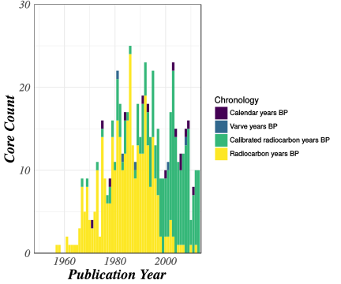
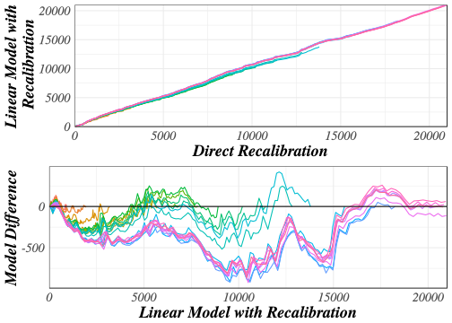
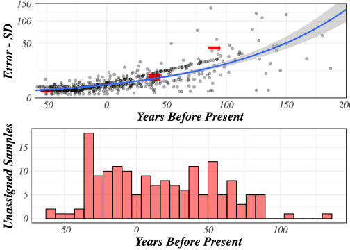
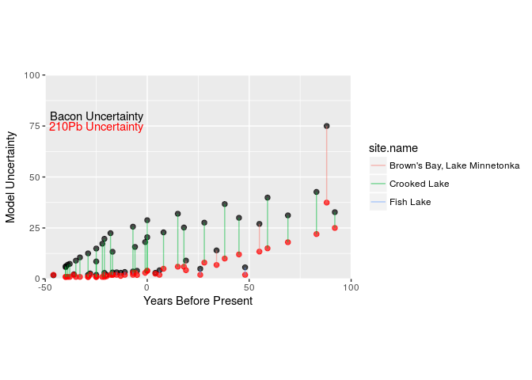
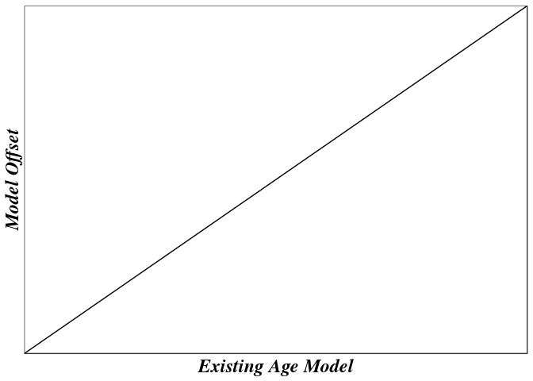

# Age Models in Large Scale Synthesis

# Introduction

Researchers are increasingly using large paleoecological databases, either in their entirety, or as localized data subsets, to either undertake synthetic analysis, or to add breadth to their new findings [@brewer2012paleoecoinformatics;@uhen2013card]. As many paleoecologists are aware however, the chronology assigned to a sedimentary archive can strongly affect the interpretation of a record. Paleoecologists have been aware of limitations in age modeling capabilities for some time, and the issues that these limitations cause are well noted [@grimm2009magnitude;@liu2012temporal].  

Recent efforts have focused on standardizing age models across the database [@giesecke2014towards], establishing regional benchmarks [@blois2011methodological;@flantua2016geochronological]. European models used the software Clam [@blaauw2010methods], as did efforts with the North American Pollen Database [@blois2011methodological]. 

As more and more ecologists are turning to the paleoecological record, and as we try to do more with what we have, the limitations of extant age models become more problematic.  Indeed, it is possible to wiggle match many different patterns, and the flexibility in modeling age-depth relationships can introduce additional "researcher degrees of freedom" that might lead to greater rates of false-positive relationships in paleoecological research [@blaauw2012out].

The Neotoma database [@grimm2008neotoma] contains 1864 global pollen records that can be used for paleoecological analysis.  These records have been obtained from publications that span a time period from  1948 to 2016, with more than half the records coming from before 1983.  For pollen records that are not "modern", sample age is obtained from a chronology constructed using classical [@blaauw2010methods] or Bayesian [@blaauw2011flexible; @buck2000bayesian;@blaauw2005radiocarbon;@ramsey1995radiocarbon] methods using dated material including radiocarbon (^14^C) and other radiometric dates (*e.g.* ^210^Pb, ^137^Cs). 

Chronologies are developed using dated stratigraphic control points from within a cores, which may be geochronological (dated material), geostratigraphic (e.g., the “modern” core top), and sometimes biostratigraphic (changes in pollen assemblages associated with dated changes on the landscape). Geochronological control point ages are often uncertain due to analytical errors during the laboratory radiocarbon dating process [@ward1978procedures], the conversion of radiocarbon to calendar years [@reimer2013selection], and potential differences between the ages of macrofossil material and age of sediment [@blois2011methodological]. Geostratigrahic markers may have fewer sources of uncertainty -- the core top age is assumed to be the year of sampling -- although sedimentary mixing of the upper sediment during sampling does introduce some uncertainty. Finally, biostratigraphic control points are determined by the examination (usually visual) of changes in pollen assemblages throughout a core. However, time series of pollen counts are noisy, and in practice identifying changes in composition is both difficult and subjective [@dawson2016quantifying]. There remains uncertainty in the identification of compositional shifts related to the chronological/stratigraphic sampling density [@liu2012temporal], and, in the case of landscape-scale phenomena such as the mid-Holocene Hemlock decline [@bennett2002determining;@davis1981outbreaks], the need to assign temporal bounds to the landscape-scale phenomenon that caused the compositional shift.

The development of the first IntCal curve was a major milestone in paleoecological analysis [@hughen1998intcal98].  IntCal98, and subsequent itterations, allowed researchers to move from radiocarbon years to calibrated radiocarbon years using material of known age and associated ^14^C dates to build a calibration curve.  Because radiocarbon years are not equivalent to calendar years, and because the relationship is non-linear, the use of calibration curves have provided researchers with an important tool to help improve model chronologies.  However, across the Neotoma database (here we refer to North America only), many records within the database still record chronologies using only radiocarbon years (Figure 1). 

The transition from age models using only radiocarbon years to those with calibrated radiocarbon years within Neotoma is dramatic.  The final radiocarbon model appears to be from 1998, following this we see no more radiocarbon models.  Along with this transition, we are seeing a second transition from simple linear models to more complex models using flexible Bayesian methods.  A critical question then becomes, when faced with records generated using only uncalibrated dates, should we calibrate radiocarbon dates, generate age models *de novo*, or ignore the records altogether?

<!-- -->

**Figure 1**.  *Number and type of default chronologies for pollen records in the Neotoma Paleoecological Database based on the original year of publication for the dataset.  Within Neotoma the default dataset chronology may be updated by subsequent researchers when this information is provided to a data steward.*

To understand the importance of developing new chronologies, it is important to understand that there can be a significant difference in interpreted ages when either, chronological control points are re-calibrated and a model is generated using those calibrated controls, or, the interpolated ages from a model are directly re-calibrated from radiocarbon years to calendar years before present.  While not the prefered method, direct recalibration of interpolated ages does occur within the Neotoma ecosystem.  For example, the temporal search function within the Neotoma Explorer (http://apps.neotomadb.org/explorer), Tilia (http://tiliait.org) and the Neotoma API (http://api.neotomadb.org) all use a lookup table that directly recalibrates ages in radiocarbon years.  However, this process results in systematic biases in both synthetic data (Figure 2) and in the actual Neotoma data (Figure 3).
flexible]

<!-- -->

**Figure 2**. *The difference between directly calibrating radiocarbon ages from an existing model and rebuilding age models using linear interpolatation from calibrated radiocarbon ages.  Negative values result when the rebuilt model provides older dates than the directly calibrated dates.  Negative values indicate that recalibration of interpolated ^14^C dates followed by linear interpolation of calibrated ages provides systematically older ages than direct recalibration of interpolated ages obtained from a dataset with linearly interpolated dates reported in radiocarbon years.*

<!-- check Lac a l'Ange and Marl Pond, also Cheyenne Bottoms, San Agustin Plains, 
     Pittsburg Basin, Aghnaghak and Chalco Lake, all have systematically large or small
     estimates for ages. -->

<!-- -->

**Figure 3**. *Direct recalibration of dates within Neotoma pollen records against semi-automated linear interpolation and calibration.  Here we use the chronological controls of the default age model, calibrate chronological controls reported in radiocarbon years, and then use linear interpolation.  Any records with age-reversals were rejected to simplify this illustrative example.*

Comparing re-calibrated age models against directly calibrated dates highlights two issues. The first is the possibility of systematic offsets for large-scale research projects, the second is the need for direct intervention and systematic rules-based chronology construction in synthesis work.  Gieseke *et al*. [-@giesecke2014towards] undertook a broad-scale reconstruction of European records based on prior reported chronologies in an effort to facilitate broad-scale reconstruction of patterns and processes of vegetation change in Europe [@brewer2016late].  Blois *et al*. [-@blois2011methodological] undertook the same process for eastern North America.  Each of these were labor intensive and resulted in the construction of multiple new age models.  This paper builds on work from Dawson *et al*. [@dawson2016quantifying], which rebuilt existing age models using the Bacon framework, by explicitly detailling the steps neccessary to reconstruct a large number of models, and by quantifying the effects of decisions on aggregate outcomes, in the process of rebuilding models.

## Limitions of linear/classical models vs Baysian efforts.

Large scale data analysis across heterogeneous data can be complex, thus the use of harmonized age models, that integrate ideas about the underlying mechanics of the processes linking depth and time become important [@blaauw2011flexible].  Developments since Blois *et al*. [-@blois2011methodological], and workshops such as the PAGES-sponsored Age Models, Chronologies, and Databases Workshop [@grimm2014working] have begun the process of outlining the methods required to undertake large-scale efforts to re-build age models.

Here we present the results of one such excercise.  In this paper we outline the decision making process around the parameter selection for the age models, we summarize differences between the original chronologies and the new chronologies, we higlight differences between chronologies generated using two age model types and highlight best practices for chronologies within large-scale synthesis.  We also identify limitations of current methods, that could serve to improve chronology construction in the future.

# Methods

## Chronological Uncertainty

### Dealing with zero-value ^210^Pb errors

Bacon requires that all chronological markers be associated with defined errors. Historically, some ^210^Pb data entered into Neotoma was entered without error reporting.  Of the 398 ^210^Pb markers in Neotoma, 148 have no error reported.  Binford [-@binford1990calculation] reports *"Ninety-five per cent confidence intervals range from about 1 -- 2 years at 10 years of age, 10 -- 20 at 100 years, and 80 -- 90 at 150 years old."*  Using this assessment we fit a smooth linear function to assign 95% confidence intervals for all ^210^Pb dates with missing uncertainty data.  These confidence intervals were then divided by 2 (and the integer ceiling taken) to obtain standard deviations to be used in the Bacon model.

<!-- -->
**Figure 4.** *Reported uncertainty for ^210^Pb dates within Neotoma, by age, with the total count of unassigned samples by age bin (lower).  Estimated uncertainty, using a model relating reported ^210^Pb uncertainty to age, is then assigned to all ^210^Pb dates with unreported uncertainty.* 
### Expert elicitation exercise to identify settlement horizon

Age estimates of pollen samples, and in some cases their uncertainty, can be estimated using an age-depth model determined by a combination of the chronological controls. To determine which sample best represents pre-settlement times, it is possible to select the sample closest in age but not younger than the time of settlement. Instead, we rely on the existence of a biostratigraphic signal corresponding with the time of interest. During European settlement, land-clearances led to noticeable increases in certain agricultural indicators that is reflected in the pollen records, especially *Ambrosia* [@mcandrews1988human]. This change in the relative abundance of Ambrosia, referred to as the *Ambrosia* rise, can be used to identify a reasonably representative presettlement assemblage that justifiable precedes major land clearance - here the pre-settlement pollen sample is defined to be the sample immediately prior to the first pollen sample that reflects the *Ambrosia* rise. We deal with some of the uncertainty associated with the identification of a biostratigraphic marker by: 1) avoiding the need to assign a date to our representative pre-settlement assemblage, and 2) using expert elicitation to reduce expert bias.

The *Ambrosia* rise is a well known phenomenon in the eastern United States, and elsewhere, that appears to be contemporraneous with Euro-American settlement, land clearance and the initiation of intensive agriculture in the region [@McAndrews1968;@mcandrews1988human]. In the Upper Midwest, significant increases in *Ambrosia*, *Rumex*, and/or Poaceae are typically coincident with the settlement horizon. Because of this feature it is possible to establish a biostratigraphic chronological control. When the rise can be identified visually it can be used as a stratigraphic marker with an age defined as either immediately preceeding (when the "pre-settlement" sample is used), or immedately after.  The pre-settlement sample has been identified for many of the fossil pollen cores in the Neotoma database, to reduce variability associated with the protocol used to determine these samples we asked a team of experts to identify pre-settlement samples based only on pollen diagrams depicting proportional changes through time as a function of depth for key indicator species and the ten most abundant arboreal taxa. Experts were prohibited from relying on stratigraphic dates (radiocarbon or other) or age-depth model estimates of sample age.

For a summary of the settlement horizon elicitation exercise, see the calibration paper [@dawson2016quantifying].

To generate the prediction data set, we would like to make use of the elicitation exercise results in order to include an additional stratigraphic marker in the chronological control tables. To do this, we need to be able to assign pre-settlement ages that correspond with the expert-determined pre-settlement depths with some confidence. From the PLS data, we have corresponding sample year for all sampled location. Within each grid cell, we determined the maximum sampling year, and then our pre-settlement age was determined by subtracting 50 from this value. The period of settlement across the upper Midwestern United States spanned from 1820 - 1910 [@goring2016novel], providing a potential period of settlement spanning nearly 100 years, thus we applied an age uncertainty (stanadrd deviation) of 50 years for the settlement marker, around the date of survey for the grid cell within which the core was located.  Ideally, methods would provide the opportunity to include asymmetric uncertainty, since, in the case of the settlement horizon, we know the minimum age, but not the most recent age of potential settlement.

Five cores were located within grid cells without digitized PLS data. In these cases, we look to the surrounding grid cells to estimate the maximum sampling year. In the upper peninsula of Michigan, there was a single site for which there was no PLS data, which was assigned a maximum sampling year of 1860. The four remaining grid cells in which there were cores but no PLS data were in the lower peninsula of Michigan, and were assigned a maximum year of sampling of 1840.

## Bacon Settings

### Accumulation Rate Priors

Bacon provides a default accumulation rate based on Goring *et al*. [-@goring2012deposition]'s survey of Holocene accumulation rates in eastern North America.  Empirical age-depth curves suggest that the age-depth relationship is non-linear, as a result of sediment compaction in the upper sediments [@goring2012deposition], basin shape [@bennett2016interpretation] and patterns of deposition and sediment transport operating on longer time scales [@goring2012deposition;@webb1988rates]. Narrowing the geographic and temporal range for the target reconstructions made it neccessary to re-asses mean accumulation rates using an approach similar to Goring *et al*. [-@goring2012deposition], focused on a narrower temporal and spatial window.  Goring *et al*. [-@goring2012deposition] show that there is a rapid inflection point in accumulation rates at approximately 500ybp.  Regionally, there is evidence that after the time of settlement, sediment accumulation is much faster (fewer years per cm of sediment accumulation) than before settlement (more years per cm of sdeiment accumulation), although bulk density may decrease (Figure 4).

Although it is compelling to speculate that the coincidence of a change in rates with Euro-American Settlement and associated changes in land use and erosion, many sites show a similar inflection, even in regions that remain largely protected from widespread land use change [@goring2012deposition]. To account for non-linearity in accumulation rates, we assign the modern prior for the post-settlement portion of the core, and a 2K prior for the pre-settlement portion of the core. In practice, it is difficult to determine settlement horizon depth, but results from an expert elicitation exercise [@dawson2016quantifying; @kujawa2016theeffect] provides us with an estimate of the settlement depth for most cores.  Cores for which experts were unable to assign a horizon were given a 2K prior only, while an "instantaneous" hiatus was placed at the pre-settlement sample depth, which then faciliated a non-linear accumulation rate witin the chronology.  No hiatus was assigned and the modern accumulation rate prior was used for cores with only core top and pre-settlement markers.

For the upper Midwest we computed empirical accumulation rates for consecutive pairs of geochronological markers, within sites obtained from the Neotoma database. We used the mean age for adjacent markers as the assigned age for each accumulation rate. Rates were split into two groups based on their ages: modern, which encompassed the present to 100 cal yr BP (the Modern prior), and from 100 cal yr BP to 2000 cal yr BP (the 2K prior). Summary statistics were computed for each group of accumulation rates. Gamma ($/gamma$) priors were defined for both time periods, each with a mean equal to the empirical mean of accumulation rates for that time period, and a variance equal to double the empirical variance from the grouped accumulation rates.  Doubling the empirical variance represents a conservative approach to modeling uncertainty, in that it accounts for additional variability in accumulation rates that was not observed in the data.

### Determining section thickness

Bacon works by diving a core into sections whose width are determined by the user [@blaauw2011flexible]. Sections are the atomic unit of a Bacon model, and various parameters are fit within each section.  In particular, the `memory` parameter defines the flexibility of the accumulation rates within a single chronology, thus a model with large section thicknesses will be, by virtue of having fewer overall sections, less flexible. However, narrow section thicknesses result in very large run-times, and may show other, unanticipated problems associated with finding fit in multi-parameter space.

Dividing a core into sections is an approximation of time discretization, abstracted through the process of deposition.  While consistent section widths across all cores (and thus consistent discretization) should be a goal, in practice, the internal unmeasurable variability in sedimentation rates, and uncertainty in the models themselves, makes the implementation of consistent section thicknesses difficult.  To provide prescriptive widths, but still allow flexibility as needed in the Bacon modelling, each core was run with widths of 5, 10, 15 and 20cm.  Model fit was assessed visually, and the best fit model was subsequently chosen to be the default calibrated age model for that core.

## Bacon Model Comparison

We run Bacon, we run BChron using the default settings for the method and we keep the data from the original model outputs.  Outputs for all models are shown and contrasted, in particular, uncertainty and age estimates.

# Results

## Age Controls

### ^210^Pb Errors

<!-- -->
**Figure 5**. *Reported and estimated ^210^Pb ages from the Bacon models show strong accordance, for the most part.  Uncertainties within the constructed Bacon models at the depths of the ^210^Pb samples show higher uncertainty, which likely reflects the influence of the model itself since the autoregressive nature of the model, the influence of the memory parameter, and the nature of the Bayesian model itself.*

<!-- -->

**Figure**. *For the three cores within the region with reported ^210^Pb and reconstructed Bacon uncertainties we see consistently higher uncertaintites for the Bacon uncertainties, although the magnitude of the difference varies by record.  Fish Lake shows the smallest difference, while Brown's Bay shows the largest difference.*

Bacon uncertainty estimates within the chronologies are consistently larger than the ^210^Pb error estimates for the point samples.  For some records the uncertainty is much higher, while for others the difference in uncertainty is lower.  It is worth noting that only three records have completely paired ^210^Pb records.  I'm not sure why.

### Expert Elicitation

## Bacon Settings

### Accumulation Rate Priors

Accumulation rates for records in the region show clear differentiation between accumulation rates within the last 200 years and accumulations prior.  Means and variance are presented in **Table 1** along with Gamma parameters.  Accumulation rates (the mean years per cm deposition) change dramatically, dropping by five-fold in the modern period.

**Figure 4**. *Sediment accumulation rates for cores in the study region with samples in the last 200 years (in calibrated radiocarbon years, with 0 at 1950 CE).  A clear break can be seen across the records.*

*Table 1*. The estimates from the accumulation rates.

 Group   Mean	   Variance	    Rate	   Shape
------ -------- ----------- -------- -------
Modern	3.02	     5.70	      0.53     1.6
2K	    15.00	     250	      0.06	   0.9

### Section Thickness

<!-- -->

Total core thickness shows a relationship to total core age (Figure).  There is a general relationship between age and depth.

## Model Comparison

Recalibrating ages from with `Bacon()` and `BChron()` show bimodal distribution of age differences.  One set of recalibrated models show almost no change, while others show a continuously increasing offset with increasing time.

<!-- SJG - I think this is because some of these ages are in radiocarbon years. -->

<!-- -->

**Figure**. *Recalibrated and reconstructed models.*

## Limitations of current models

| Challenge | Solution |
| ---------- | ------------ |
| Age uncertainties vary in their distributions. |  Allow uncertainty models to include other distributions, including truncated distributions. |
| Age models require significant oversight |  Codify certain decisions, provide testing suites for fit parameters. |
|   |   |

# Discussion

There are some broad patterns, and some specific comments.

# Conclusions

We know lots now that we didn't know before.  If you read carefully you would too.

# Acknowledgements

This work is a contribution of the PalEON Project (http://paleon-project.org).  SJG would like to thank support from NSG, CEG and AMG.

# References
